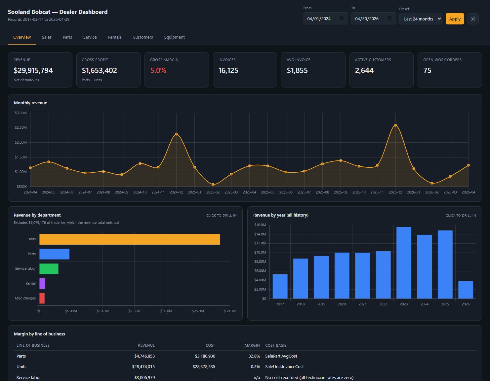
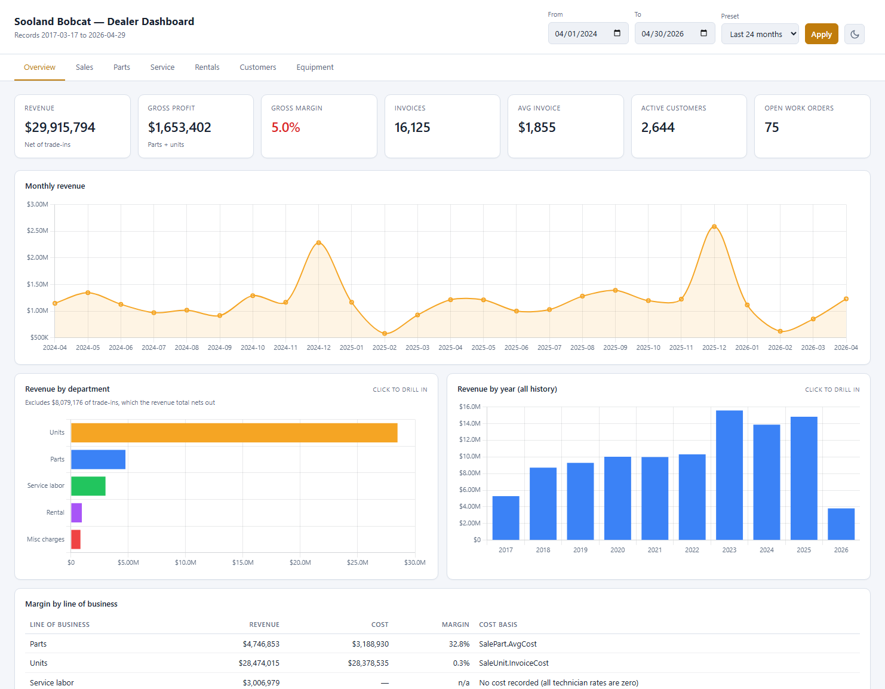
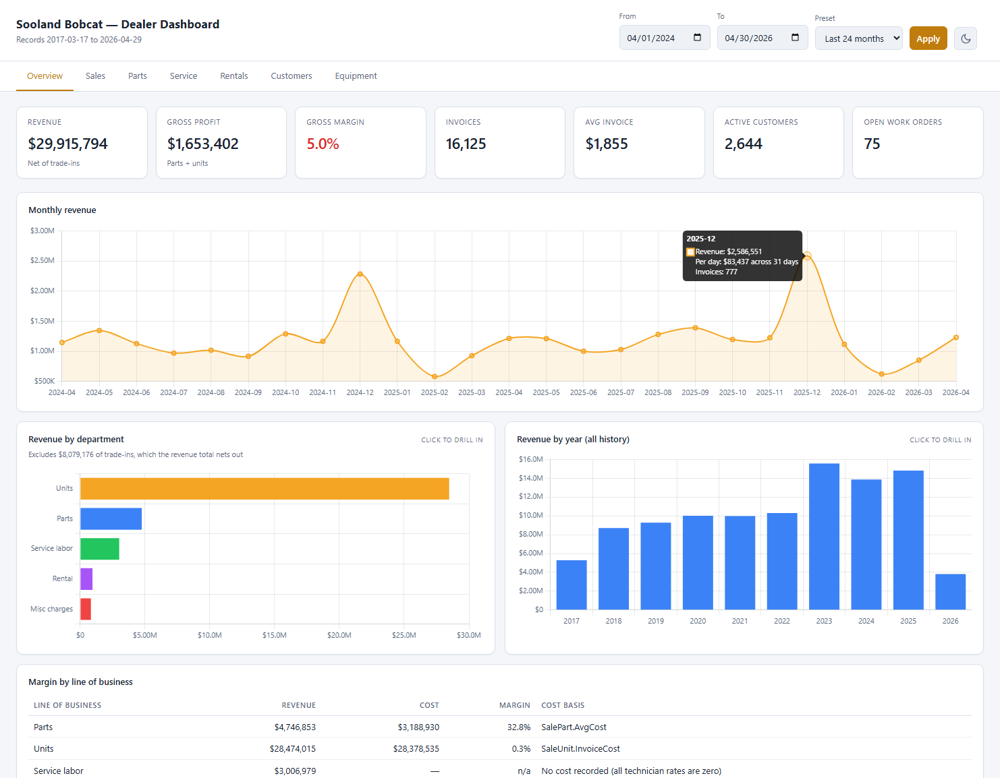
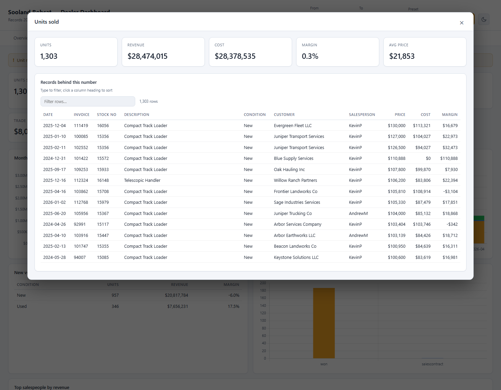
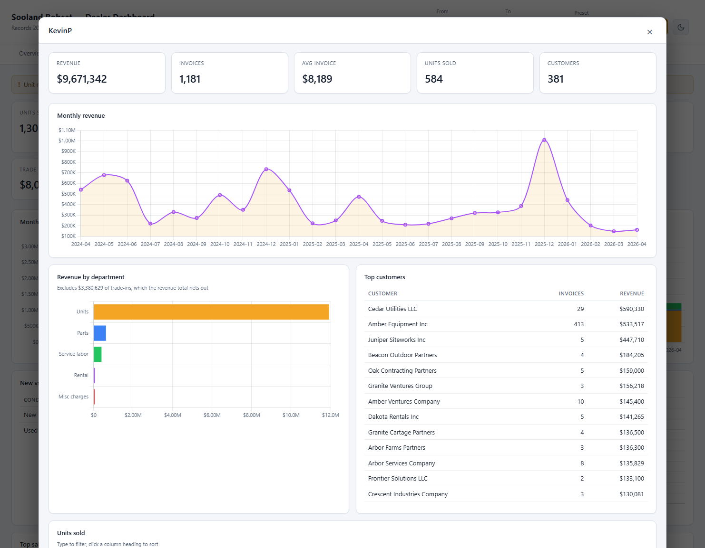
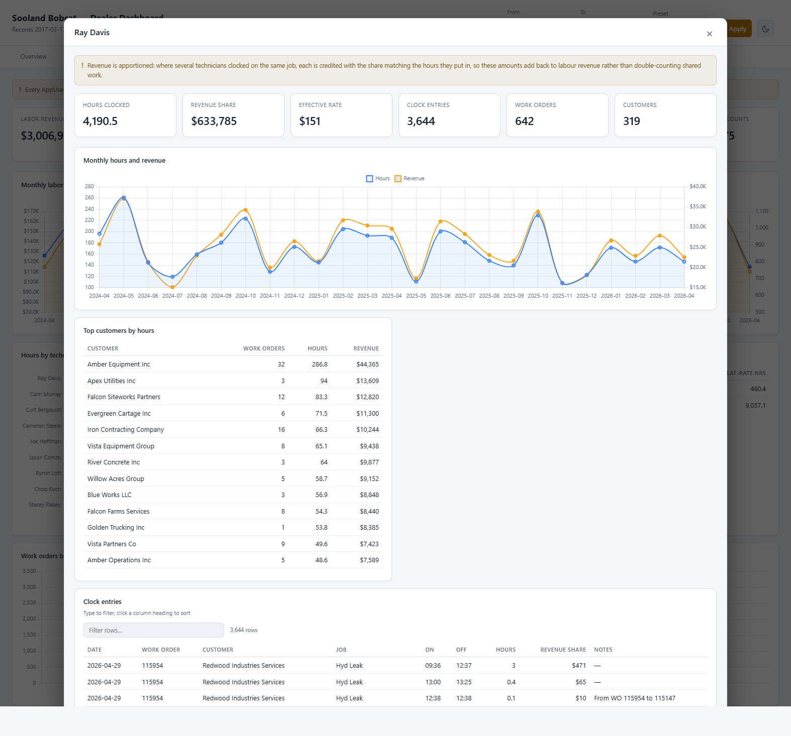
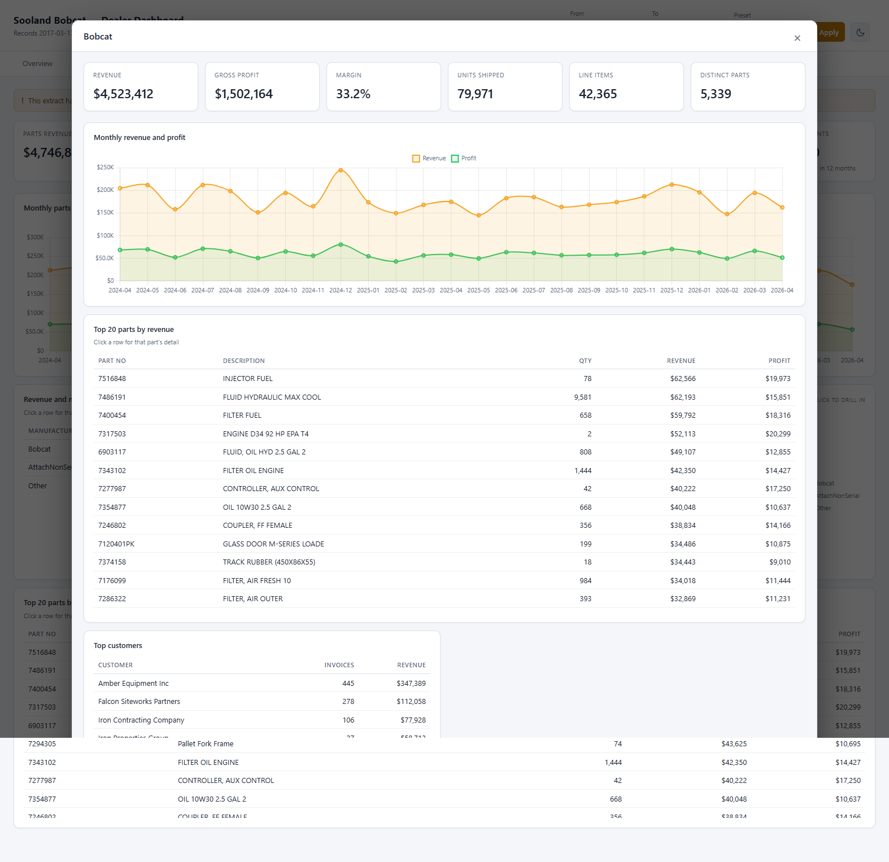
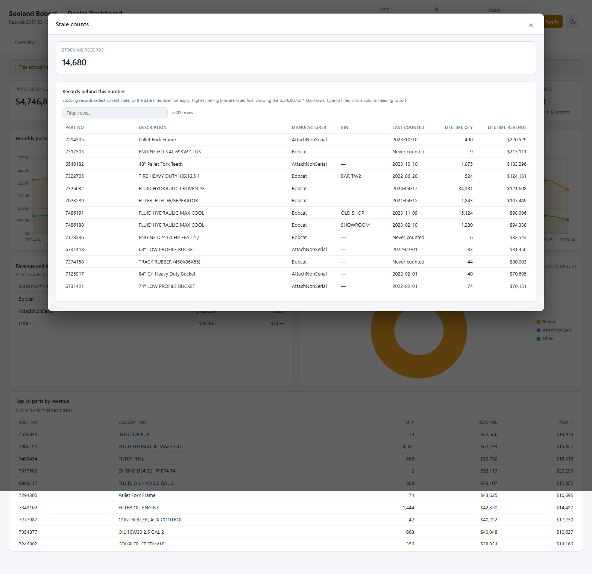
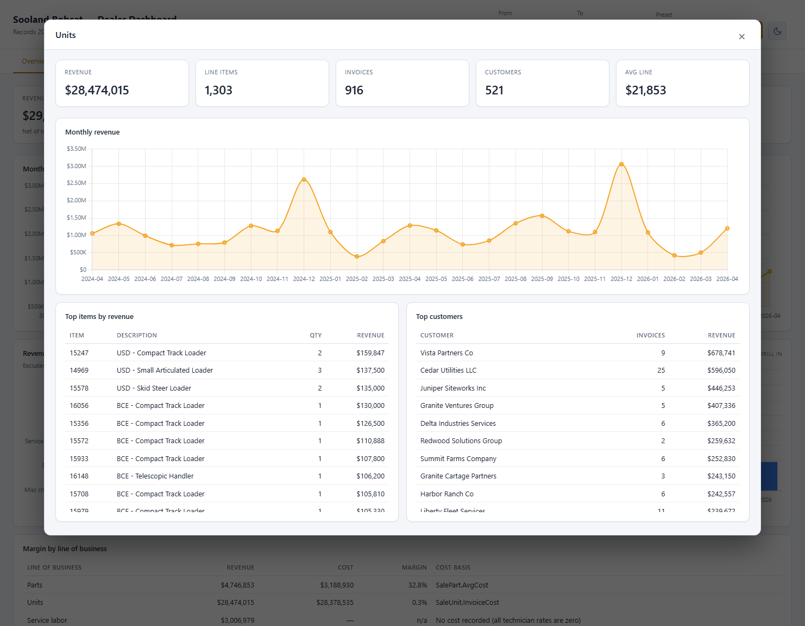
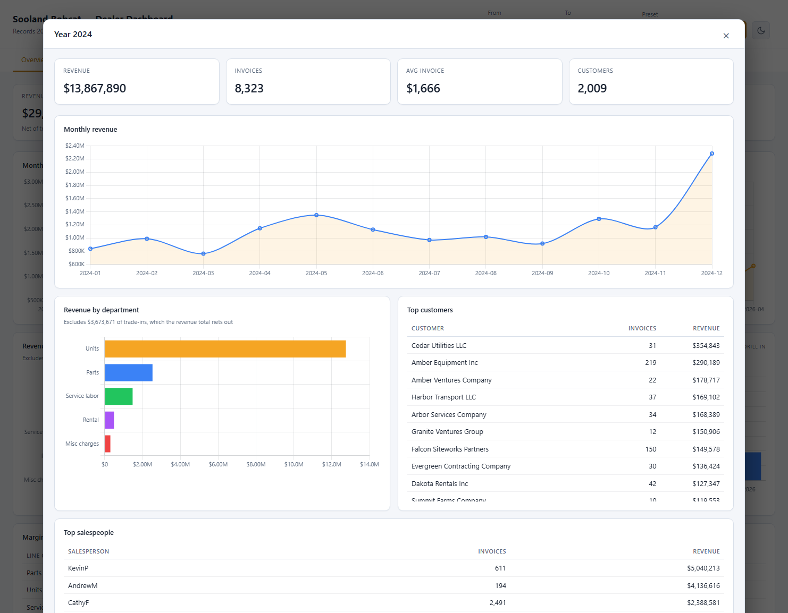

# Sooland Bobcat Dealer Dashboard

A local browser dashboard over `perseus_equipment_database.db`, an equipment
dealership ERP extract covering 2017-03-17 through 2026-04-29. One executive
overview plus six department deep-dives.



## Running it

```powershell
python -m venv .venv
.\.venv\Scripts\python.exe -m pip install -r requirements.txt
.\.venv\Scripts\python.exe -m uvicorn app:app --port 8000
```

Then open <http://127.0.0.1:8000>. Tabs are deep-linkable, for example
`http://127.0.0.1:8000/#parts`.

The date filter drives every tab except Equipment, which describes current
inventory state. Presets cover 12, 24, and 36 months plus all history; the
default is the 24 months ending at the last invoice in the file.

The button beside Apply switches between light and dark. The first visit
follows the operating system's `prefers-color-scheme`, and the choice is
remembered in `localStorage` after that.



## Layout

| File | Role |
| --- | --- |
| `app.py` | FastAPI routes, one per tab, plus background cache warming |
| `queries.py` | Every SQL query, grouped by tab |
| `db.py` | Read-only connection per thread and a one-hour result cache |
| `static/app.js` | Tab definitions, KPI cards, Chart.js rendering, theming |
| `static/style.css` | Light and dark palettes as CSS custom properties |

Adding a KPI means adding a field in `queries.py` and referencing its key in
the matching tab's `kpis` array in `static/app.js`. Charts and tables are
declared the same way, so most changes touch only those two files.

## How the numbers are defined

Revenue is the sum of `InvoiceDetail.NetExt` on active, finalized invoices.
Line items rather than `InvoiceHeader.TotalInvoice` are used so the headline
figure and the department breakdown always tie out. Trade-in lines are
negative, so revenue is net of trades. Voided and draft invoices are excluded.

The revenue-by-department charts leave trade-ins off. As a single large
negative bar it roughly doubled the axis range and squashed the real
departments into a fraction of the width. The bars therefore sum to more than
the Revenue KPI on purpose, and each chart captions the excluded amount so the
difference is stated rather than hidden. The `/api/overview` and
`/api/drill/year` payloads still carry the trade-in row, so nothing downstream
loses it.

Cost exists only for parts (`SalePart.AvgCost`) and whole units
(`SaleUnit.InvoiceCost`), so gross margin covers those two lines of business.
The Overview margin table still lists service labor and rentals with their
revenue and names the missing cost basis, so the gap is visible rather than
implied by an absent row.

Every line chart draws a marker on each monthly reading so it is clear where
to point for a tooltip. Markers shrink on long ranges to stay legible when a
hundred months are on screen, and their hit area stays generous either way.

Hovering a point on the Overview monthly revenue chart adds a per-day figure
alongside the month total. The divisor is the number of days in that month
that fall inside the selected range, so partial months at either end of the
window are not overstated.



The Overview department and year charts drill down: clicking a bar opens a
detail view over the dashboard. Department detail covers the monthly trend,
top items, and top customers for that line of business; year detail covers the
monthly trend, department split, top customers, and top salespeople. Both are
served by `/api/drill/department` and `/api/drill/year` and reconcile to the
cent against the chart that opened them.

On the Sales tab every KPI card is clickable and opens the records behind that
number. The ten cards are slices of three record sets — unit sale lines,
trade-ins, and quotes — and `SALES_METRICS` in `queries.py` holds the clause
that narrows each source to exactly the rows the card counted. The drill
re-runs the card's own aggregate over that slice, so the summary at the top of
the detail view always restates the figure that was clicked. Clicking a row in
Top salespeople opens that rep's monthly trend, department mix, top customers,
and the units they sold.

The Parts tab works the same way, with one wrinkle. Its eight cards are drawn
from three different places: five come from parts sale lines, Active catalog
and Never sold come from `PartMaster`, and Stale counts comes from
`PartLocation`. The last three describe inventory as it stands today rather
than activity in a window, so their drills ignore the date filter and say so.
Each of those lists is ordered to be useful rather than alphabetical — the
catalog and stale-count lists lead with the highest lifetime sellers, so the
bins worth counting first are at the top, and the never-sold list leads with
the parts that have sat longest.

Clicking a row in Revenue and margin by manufacturer, or a slice of the
doughnut beside it, opens that manufacturer's monthly revenue and profit, its
top parts, its top customers, and every sale line behind it. Rows in Top 20
parts by revenue open the same view for a single part, and the top-parts table
inside a manufacturer drill is clickable too, so you can go from a
manufacturer straight down to one part without backing out.

On the Service tab, clicking a bar in Hours by technician opens that
technician's monthly hours and revenue, their top customers by hours, and
every clock entry behind the bar, down to the times on and off and whatever
note the technician left.

Revenue there needs a caveat, and the drill states it up front. About one
segment in eight has more than one technician clocked on it, and those tend to
be the big jobs, so crediting each technician with the whole segment would
overstate service revenue by 72%. Each one is instead credited with the share
of the segment matching the share of the hours they put in. Across the default
window that apportionment adds back to $3,006,125 against labour revenue of
$3,006,979 — the $854 difference is segments that carry revenue but have no
clockings against them at all.

Two things worth knowing about the underlying hours. The chart counts clocked
time from `WorkInProgress`, while the Actual hours card sums
`InvoiceSegment.ActualHrs`; they are independent columns that happen to agree
to within about a single hour across two years, which is a good sign for both.
And `ElapsedHours` is stored as an integer on roughly a tenth of the rows, so
the apportionment multiplies by 1.0 before dividing — without that SQLite does
integer division and silently drops $41.5k of the shares.

Detail tables are filterable: type to narrow the rows across every column, and
click a column heading to sort, numbers descending first and text ascending.
The row counter shows how much of the set is in view. Filtering and sorting
happen in the browser over the whole slice, so they do not re-query.















Performance: the heaviest uncached query is about 1.8 seconds across the full
nine years. Results are cached for an hour and the common ranges are warmed on
startup, so normal navigation lands in single-digit milliseconds.

## Known limits in the source data

These are properties of the extract, not bugs, and each is surfaced as a
banner on the relevant tab.

- **No on-hand inventory quantity.** `PartLocation` carries min/max reorder
  thresholds but no current stock level, so parts stock value and inventory
  turns cannot be computed. Parts that have never sold (2,692 of 16,113) are
  used as a dead-stock proxy.
- **No labor cost.** Every `AppUser.HourlyRate` and `OTRate` is zero, so
  service margin is not derivable. `InvoiceSegment.LaborRate` is populated but
  it is the rate billed to the customer, not what the technician costs. The
  Service tab reports hours, revenue, and effective rate.
- **No rental cost.** `DepreciationAmt`, `DepreciationPct`, and `SalvageValue`
  are zero on all 22,995 rental units, so rental margin is not derivable
  either. Only the GL account reference is populated.
- **Unit sales margin is genuinely thin.** Recent years run near or below
  zero. Part of this is 43 unit lines in the default window that carry real
  cost but no price, which are bundled attachments and fleet transfers. The
  Sales tab reports margin on priced units and the all-in figure side by side.
- **Quote win rate is not meaningful as a raw ratio.** `QuoteDetails` has one
  row per invoice defaulting to `unqualified`, so only decided outcomes are
  counted and the rate is suppressed when nothing was lost.
- **Receivables ignore the date filter.** The balance is the lifetime net of
  credit charges (`recv`) against payments (`recvpmt`), joined to customers
  through `InvoiceHeader`, not `PaymentReceivablesDetail`, which only carries
  the charge side.
- **Rental utilization is an estimate.** `UnitBase.Rental` reflects only
  today's fleet (106 units) while 163 distinct units actually rented in the
  default window, so the denominator is the units that went out rather than
  the flag.
- **Equipment ageing is partial.** Only 45 of 187 in-stock units have a
  received date, and 172 have a cost. Retail prices are too sparse to report.

## A note on the data

This is a real dealership's records. Contact details have been scrubbed
(emails are `@example.com`, phones are `555-0100`) but customer names,
employee names, and financial figures are intact. The database is opened
read-only and the server binds to localhost. No query touches the password or
PIN columns on `AppUser`.
